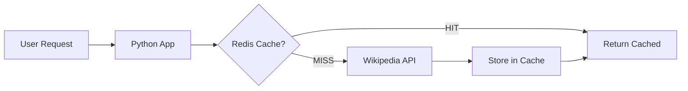

# 📦 Phase 1: Redis Caching - Learning Guide

This guide explains the caching concepts you've implemented in your Wikipedia Agent.

---

## 🎯 What We Built



---

## 🧠 Key Concepts

### 1. Cache-Aside Pattern (Lazy Loading)
The app checks the cache first. If data isn't there (MISS), it fetches from Wikipedia, then stores it for next time.

```python
# Pseudocode
def get_data(key):
    cached = redis.get(key)
    if cached:
        return cached  # HIT - fast!
    
    data = fetch_from_wikipedia()  # MISS - slow
    redis.set(key, data, ttl=3600)  # Store for next time
    return data
```

### 2. TTL (Time-to-Live)
Data expires after a set time. This balances freshness vs. performance.

| TTL | Best For |
|-----|----------|
| 1 hour | Search results (frequently updated) |
| 2 hours | Article sections (more stable) |
| 24 hours | Static reference data |

### 3. Cache Key Design
Good keys are unique and descriptive:
```
wiki:search:a1b2c3d4    # Hash of query
wiki:sections:e5f6g7h8  # Hash of topic
```

---

## 📁 Files We Created/Modified

| File | Purpose |
|------|---------|
| `cache.py` | Redis connection, decorator, stats |
| `mcp_server.py` | Added `@cache_result` decorator to tools |
| `mcp_client.py` | Added `/api/cache/stats` endpoint |
| `.env.example` | Redis configuration variables |

---

## 🔧 How to Test

### 1. Install Redis on your VM
```bash
# Ubuntu/Debian
sudo apt install redis-server
sudo systemctl enable redis-server
sudo systemctl start redis-server

# Verify
redis-cli ping  # Should return PONG
```

### 2. Update your .env
```bash
REDIS_HOST=localhost
REDIS_PORT=6379
```

### 3. Test caching behavior
```bash
# First request (cache MISS - slow)
curl -X POST http://localhost:8000/api/chat \
  -H "Content-Type: application/json" \
  -d '{"message": "Tell me about Python"}'

# Second request (cache HIT - fast!)
curl -X POST http://localhost:8000/api/chat \
  -H "Content-Type: application/json" \
  -d '{"message": "Tell me about Python"}'

# Check cache stats
curl http://localhost:8000/api/cache/stats

# Clear cache
curl -X DELETE http://localhost:8000/api/cache
```

---

## 📊 Monitoring Cache Performance

Visit `/api/cache/stats` to see:
```json
{
  "status": "connected",
  "wiki_cached_items": 5,
  "total_hits": 42,
  "total_misses": 10,
  "memory_used": "1.2M"
}
```

**Hit Rate** = hits / (hits + misses) × 100%

A good hit rate is **80%+** for this application.

---

## ⚠️ Common Pitfalls

| Problem | Solution |
|---------|----------|
| Stale data | Lower TTL or add manual invalidation |
| Cache stampede | Use locking (advanced) |
| Memory overflow | Set `maxmemory` in Redis config |
| Redis down | Graceful degradation (we handle this!) |

---

## ✅ What You Learned

- [x] Cache-aside pattern
- [x] TTL strategies
- [x] Cache key design
- [x] Graceful degradation when Redis is down
- [x] Monitoring cache performance

**Next: Phase 2 - Database Persistence with PostgreSQL**
